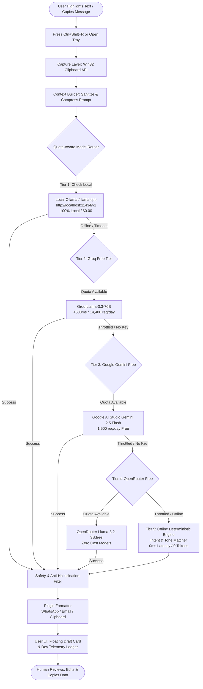

# 02 — Architecture & Quota-Aware Router: FirstReply PC

**Author:** Daylon Naidoo & Antigravity CCCO  
**Version:** 1.0.0  
**Status:** IMPLEMENTED & VERIFIED  

---

## 1. System Overview

**FirstReply PC** is an ultra-fast, local-first PC desktop AI system engineered to draft contextual first replies to messages, chats, and emails under 2 seconds without charging the user a single cent.

### Architecture Principles:
1. **$0.00 Hard Guarantee**: Core AI requires no paid subscriptions, no credit cards, and no pay-per-token charges.
2. **Local Priority**: If a local runtime (Ollama, LM Studio, llama.cpp) is detected, inference stays 100% on-device and airgapped.
3. **Graceful Cascading**: If local models are unavailable, the router steps down to verified free cloud tiers (Groq Free, Google Gemini Free, OpenRouter Free), and ultimately falls back to an offline deterministic template engine.
4. **Hard Gate Control**: The AI produces drafts only. The human owner has absolute authority to review, edit, copy, or discard.

---

## 2. Multi-Tier Router Flow Diagram

---

## 3. Quota Guard Specifications

| Provider | Target Model | Free Daily Limit | Stop Threshold (95%) | Cost | Privacy |
|---|---|---|---|---|---|
| **Ollama (Local)** | `llama3.2:3b` / `qwen2.5:3b` | Unlimited | Unlimited | **$0.00** | 🟢 Local (Airgapped) |
| **Groq Free** | `llama-3.3-70b-versatile` | 14,400 req/day · 1M tokens/day | 13,680 req / 950K tokens | **$0.00** | 🟡 Cloud Free Tier |
| **Google Gemini Free** | `gemini-2.5-flash` | 1,500 req/day · 1M tokens/day | 1,425 req / 950K tokens | **$0.00** | 🟡 Cloud Free Tier |
| **OpenRouter Free** | `meta-llama/llama-3.2-3b-instruct:free` | 500 req/day | 475 req | **$0.00** | 🟡 Cloud Free Tier |
| **Offline Template** | `rules-engine-v1` | Unlimited | Unlimited | **$0.00** | 🟢 100% Offline |

### Prompt Budgeting Rules:
- **Max Input Characters**: `1,500 chars` (~350 tokens). Inputs exceeding this are safely compressed at word boundaries.
- **Max Output Tokens**: `256 tokens` default limit. Prevents runaway completions and stays well within provider free thresholds.
- **Automatic Reset**: Quota consumption counters roll over at 00:00 UTC daily.

---

## 4. Safety & Anti-Hallucination Filter

Inheriting BCComputers' non-negotiable standard:
- **Prompt Injection Neutralization**: Inbound emails containing prompt override instructions (e.g., `ignore previous instructions`) are flagged and redacted.
- **PII Scrubbing**: Card numbers and sensitive identifiers are masked before reaching any model.
- **Fact Whitelist**: Any unverified price quotes or external URLs not in the owner's facts profile are blocked from the final draft.
